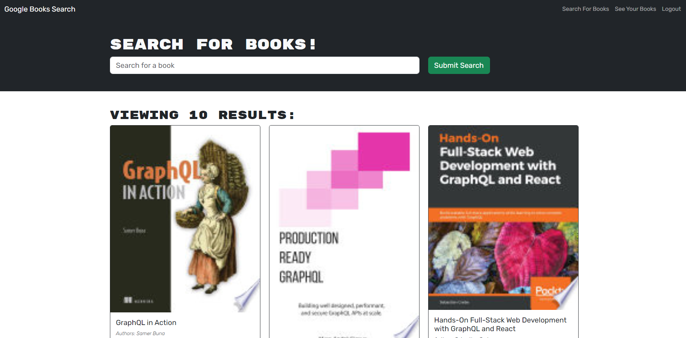

[](https://opensource.org/licenses/MIT)

# Book Search Engine

## Description

This project is a refactor of a Google Books API search engine, originally built with a RESTful API, updated to implement a GraphQL API with Apollo Server. Built using the MERN stack (MongoDB, Express.js, React, Node.js), it features a React front end and MongoDB for storing users' book search data. The motivation was to learn how to implement GraphQL in real-world applications, optimizing data fetching and performance. By switching to GraphQL, the project improves the efficiency of searching and saving books while reducing API calls. Key learnings include setting up Apollo Server, integrating GraphQL into a MERN stack, and deploying the application with MongoDB Atlas.

Deployed Link: https://book-search-engine-dd9r.onrender.com

## Table of Contents

- [Installation](#installation)
- [Usage](#usage)
- [License](#license)
- [Contributing](#contributing)
- [Questions](#questions)

## Installation

1. **Clone the repository**

   Start by cloning the repository to your local machine using the following command:

   ```bash
   git clone https://github.com/RoryDowse/book-search-engine.git
   ```

2. **Navigate to the project directory**

   Move into the directory of the project:

   ```bash
   cd your-project-repo
   ```

3. **Install dependencies**

   ```bash
   npm install
   ```

4. **Run the Application Locally**

   ```bash
   npm run develop
   ```

## Usage

### 1. Search for Books

- On the homepage, you'll see a search bar where you can enter the title of a book.
- Type in your search query and press the "Submit Search" button.
- The application will fetch the results from the Google Books API and display a list of books matching your query.

### 2. Save Books to Your List

- For each book in the search results, there will be a "Save this book!" button.
- Clicking this button will add the book to your personal list, which is stored in your MongoDB database.

### 3. View Saved Books

- Navigate to the See Your Books page via the top menu or sidebar.
- Here, you'll find a list of all the books you've saved during previous searches.

### 4. Remove Books from Your List

In the Saved Books section, there is a "Delete this Book!" button in each saved book.
Clicking this button will remove that book from your list.

.

## License

This project is licensed under the MIT license.

## Contributing

### Collaborators

Special thanks to the following collaborators who contributed to this project:

- **Kyle Vance**
- **Luis Sanchez**

Both provided assistance with the server file path.

### Third-Party Assets

This project also makes use of the following third-party assets and libraries:

- **[Apollo Server](https://www.apollographql.com/docs/apollo-server/)** – A library used to create the GraphQL server, handling queries and mutations.
- **[GraphQL](https://graphql.org/)** – A query language for APIs used to improve data fetching and API efficiency.
- **[MongoDB Atlas](https://www.mongodb.com/cloud/atlas)** – A cloud-based database service used to store user data, such as saved books.

## Questions

Please visit my GitHub profile: https://github.com/RoryDowse.<br>
For additional questions, please contact me at: rorydowse@hotmail.com.
